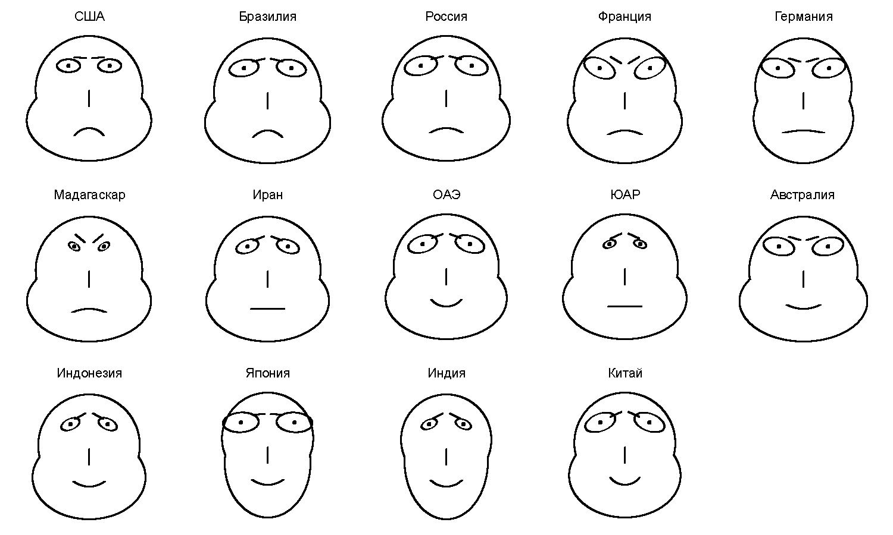

# covid_visualization

В данном примере представлена визуализация данных о заболеваемости COVID-19 с расположением лиц на карте мира.
Данные взяты с сайта [ВОЗ](https://covid19.who.int/).
Результат по странам:

Результат на карте мира:

