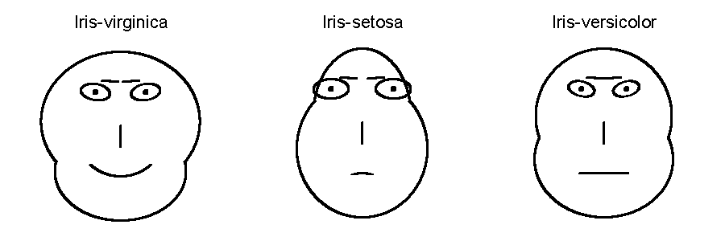

# iris_visualization
В данном примере представлена визуализация датасета [Ирисов Фишера](https://ru.wikipedia.org/wiki/%D0%98%D1%80%D0%B8%D1%81%D1%8B_%D0%A4%D0%B8%D1%88%D0%B5%D1%80%D0%B0)
Визуализация средних значений по каждому кластеру:

Визуализация случайных 25 Ирисов:

